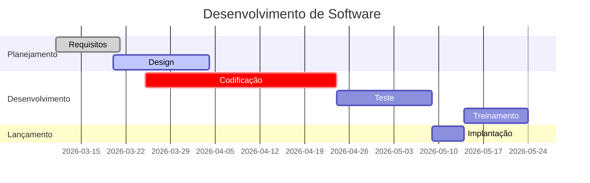

```mermaid
   gantt
   %%%Definir titulo principalç
   title Desenvolvimento de Software

    %%%Definir o formato data (Ano-Mês-Ano)
    dateFormat YYYY-MM-DD
    %%%Criação do agrupamento visual para as tarefas iniciais
    section Planejamento

    %%%'done': Tarefa concluida (Fica cinza). 'req' é o ID da tarefa
    Requisitos :done, req, 2026-03-11, 10d

    Design :active,des,2026-03-20, 15d

    section Desenvolvimento

    Codificação :crit, dev, 2026-03-25, 30d

    %%%Realiza a tarefa quando a tarefa dev terminar
    Teste :test, after dev, 15d

    Treinamento: tra, after dep, 10d

    Section Lançamento
    Implantação: dep, after test, 5d


```
